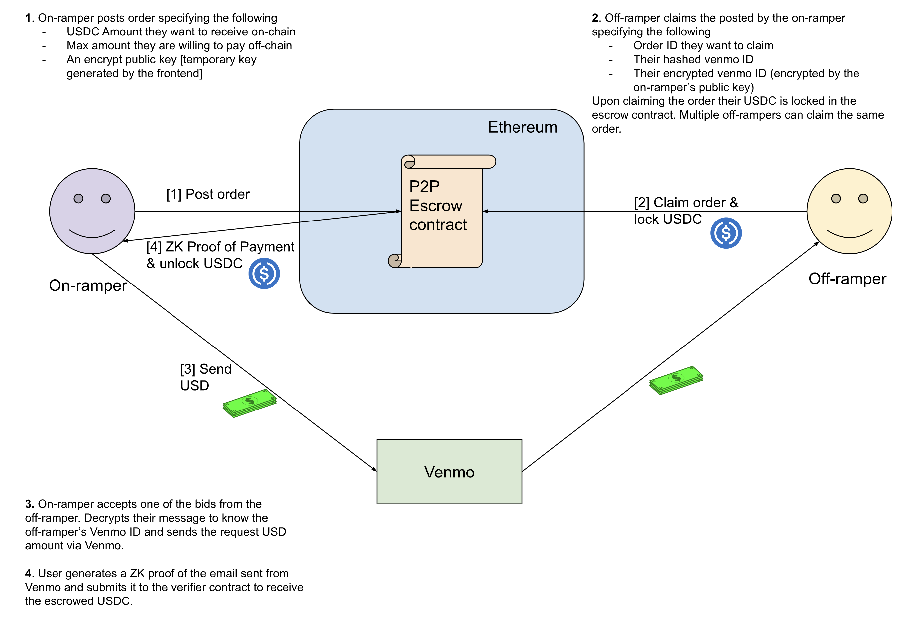

# ZKP2P

### A trustless P2P fiat onramp powered by ZK proofs

ZKP2P is a trustless P2P fiat onramp that can be built on top of any web2 payment rails (e.g. Venmo) without permission from the payment network itself. The network is powered by ZK proofs of DKIM signatures in payment confirmation emails. We build upon the 0xParc / PSE [ZK Email](https://github.com/zkemail/zk-email-verify/) libraries to prove the SHA256, email regex and RSA without revealing sensitive contents in the email. Upon successful proof generation, a user will be able to trustlessly unlock escrowed assets on-chain.

The PoC is live on Goerli! Try it at [zkp2p.xyz](https://zkp2p.xyz/). *Note: repo currently in heavy development.*

Part of [ZK Hack Lisbon](https://www.zklisbon.com/) 2023 (2nd place winner). Our demo at the [ZK Hack closing ceremony](https://www.youtube.com/watch?v=GjxNsZ-Gg-Q) and [Devfolio](https://devfolio.co/projects/zkpp-23ef)

Follow for announcements and updates!

[Twitter](https://twitter.com/zkp2p)

[Telegram](https://t.me/+XDj9FNnW-xs5ODNl)

### Problem
- New retail users face huge barriers to onboard funds onto web3
- Users must register for a centralized exchange (e.g. Coinbase) or use centralized fiat onramps which charge high fees (e.g. 5%)
- Crypto natives are unable to offboard funds into the real world
- Only institutional accounts have direct access to convert USDC or USDT to USD
- Existing P2P solutions either require meeting in person (e.g., LocalBitcoins) or rely on a centralized intermediary (e.g., OTC desks)

### High Level Flow

There are 2 actors in the system: 1) off-rampers and 2) on-rampers:
1. Off-rampers are users who intend to trade their USDC on-chain to USD on Venmo
2. On-rampers are users who intend to trade their USD on Venmo to USDC on-chain

Following table contains information about our main circuit:
|Metric|Value|
|------|------|
|constraints| 6618823|
|public inputs| 18|
|public outputs| 4|
|private inputs| 7478|
|wires| 6400562|
|labels| 30385320|

### Usage

#### Fetching Venmo ID Instructions
ZKP2P on-ramping requires submitting Venmo IDs on chain so the on-rampers knows where to send the payment. A Venmo ID is unique identifier (e.g. 1234567891011121314 up to 19 digits) for your Venmo account that is separate from your handle (@Venmo-User). They are encrypted with keys generated automatically for the on-ramper and stored locally. We cannot extract Venmo handles directly from the ID as it violates Venmo's Terms of Service. You can look up your Venmo ID using one of the following methods:
- Open any Venmo payment receipt email and click on 'Show original' and search for `user_id`. As of writing these instructions [4/30/2023], you should be able to locate your id in multiple places but may need to splice the `3D` encoding in front of the id.
- Paste `curl https://account.venmo.com/u/[YOUR_VENMO_HANDLE] | grep -o '"user":{"displayName":"[^"]*","id":"[0-9]*"' | sed 's/.*"id":"\([0-9]*\).*/\1/'` into the command line.

To verify your id, you can go to https://venmo.com/code?user_id=[YOUR_VENMO_ID] and the page should resolve to a profile for your account.

#### Approving and Acquiring FakeUSDC
As of 4/30/2023, users must mint and approve the fake USDC token on Goerli to interact with our app. We still haven't wired it into the UI flow yet, so you must do it manually. You can do so by going to the FakeUSDC Etherscan link below and calling the `mint` function with the amount of USDC you want to mint. Then, on the same Etherscan page and call the `approve` function with a USDC value scaled by 10e6 and the address of the Ramp contract (below)

#### Deployed Addresses (Goerli)

* Ramp - [0x945D14a5c63769f4cf008a2994810940cc0DFd5C](https://goerli.etherscan.io/address/0x945D14a5c63769f4cf008a2994810940cc0DFd5C)
* FakeUSDC - [0xf6426A1fdE02c3d6f10b4af107cDd7669574E74C](https://goerli.etherscan.io/address/0xf6426A1fdE02c3d6f10b4af107cDd7669574E74C)

### Limitations
- Slow proving time
- Mechanism relies on trusting Venmo. It is likely not sound for large transactions where a malicious actor has more incentive to attack the system. (e.g. chargebacks, convincing Venmo signatures to sign a malicious email). Hopefully for smaller transactions, there is more recourse (e.g. user ID is doxxed and victim can complain to Venmo)
- Currently only supports USDC and Venmo. Can be extended to other P2P payment systems (e.g. Paypal, Zelle) and other assets (ETH, NFTs etc.)

### Future Work
- Deploy to prod!
- Design around edge cases (What if a hacker gets Venmo to sign a malicious email? What are ways of recourse? How to deal with chargebacks? Nullifiers?)
- Optimizations. Speed up proving time perhaps using Halo2 libs
- Integrate more P2P payment systems (Paypal, Zelle) and potentially bank ACH / wires
- Onchain composability 👀
